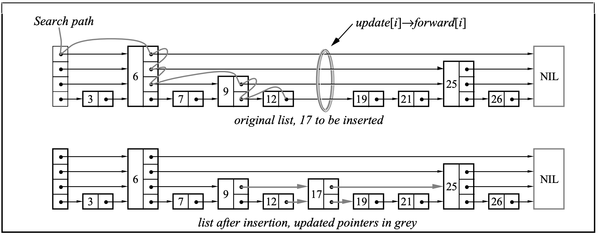

基于跳表实现的轻量级键值型存储引擎(CPP实现)
1. 实现数据插入、数据删除、数据查询、数据展示 
2. 实现数据落盘、文件加载数据，以及数据库大小显示 
3. 测试随机写读情况下，每秒可处理写请求数（QPS）: 59.83w，每秒可处理读请求数（QPS）: 67.61w

## 项目文件
* skiplist.h 跳表核心实现
* store/dumpFile 数据存放本地磁盘文件
* main.cpp 实例，使用skiplist.h进行数据操作
* stress_test.cpp 压力测试文件

## 接口
* insertElement（插入数据）
* deleteElement（删除数据）
* searchElement（查询数据）
* displayList（展示已存数据）
* dumpFile（数据落盘）
* loadFile（加载数据）
* size（返回数据规模）

## 插入数据

## 压力测试
### 插入操作
跳表树高：20
采用随机插入数据测试：
|  插入数据规模(万条) | 跳表中实际插入数据总数  | 耗时(秒)  |
|  ----  | ----  | ----  |
| 10w  | 63125   | 0.06978 |
| 50w  | 316082  | 0.65437 |
| 100w  | 632059 | 1.67133 |
每秒可处理写请求数（QPS）: 59.83w
### 取数据操作
|  取数据规模(万条)   | 耗时(秒)  |
|  ----  | ----  |
| 10w   | 0.06184 |
| 50w   | 0.63370 |
| 100w  | 1.47907 |
每秒可处理读请求数（QPS）: 67.61w
## 参考
[维基百科](https://en.wikipedia.org/wiki/Skip_list)
[跳表实现-知乎](https://zhuanlan.zhihu.com/p/224575404)
[github](https://github.com/youngyangyang04/Skiplist-CPP)
